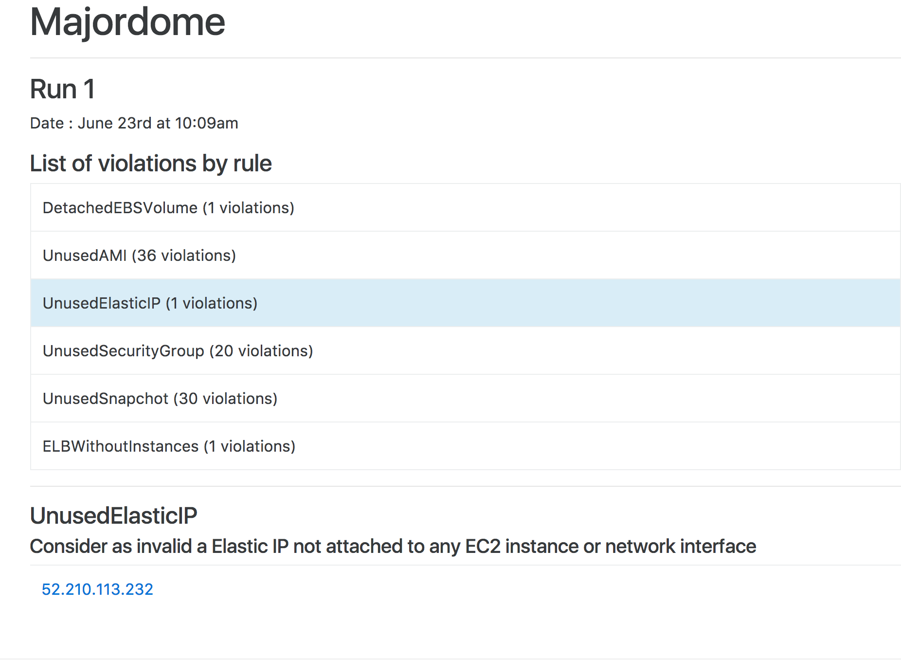

Majordome
========

[](https://travis-ci.org/romibuzi/majordome)

Majordome is both a command line tool and a web interface looking for unused resources on your AWS cloud based on a set of defined rules.

Majordome has been highly inspired by Netflix's [Janitor Monkey](https://github.com/Netflix/SimianArmy/wiki/Janitor-Home),
a monkey part of the [Simian Army](http://techblog.netflix.com/2011/07/netflix-simian-army.html) which has the same goal in mind.

This is an overview of what Majordome can detect with existing rules :

- Detect an [AMI](http://docs.aws.amazon.com/AWSEC2/latest/UserGuide/AMIs.html) not used by any EC2 instance
- Detect a [EBS Volume](https://aws.amazon.com/ebs/) not attached to any EC2 instance
- Detect a Snapshot of a EBS Volume that doesn't or no more exists
- Detect a Unused [Elastic IP](http://docs.aws.amazon.com/AWSEC2/latest/UserGuide/elastic-ip-addresses-eip.html)
- Detect a Unused [Security Group](http://docs.aws.amazon.com/AWSEC2/latest/UserGuide/using-network-security.html)
- Detect a LoadBalancer without
EC2 instances attached behind it

### Prerequisites

- PHP 5.6 or 7+ with curl and sqlite3 extensions
- Sqlite3
- [Composer](https://getcomposer.org/)
- AWS credentials (see below)

Make sure to export your AWS access key and secret :

```
export AWS_ACCESS_KEY_ID='...'
export AWS_SECRET_ACCESS_KEY='...'
```

Or you can put them under `~/.aws/credentials` to prevent you to export them at each session :

```
[default]
aws_access_key_id = '...'
aws_secret_access_key = '...'
```

Finally, you have to copy [config.php.dist](app/config.php.dist) to `app/config.php` and edit following settings : `aws.region`, `aws.accountId` and `report` section for email reporting. accountId must not have  `-` ex:`63383838383`, so get rid of them from your typical accountId format.

You can also specify which rule to enable or disable under the `aws.rules` key in the app/config.php.

### Install and Run Majordome

```
$ make install
$ make run
```

This will run the Majordome process, which will crawl different AWS resources and run each of them against the rule engine to decide if the resource is valid or not.

Majordome will save the run and its `violations` (a violation is when a resource is identified as invalid by a rule) under a small sqlite database.

*Note* : To be efficient, Majordome should have extensible **read** access to different AWS resources, as EC2 instances, security groups, Snapshots,
Volumes, Elastic Load Balancers and so on...

As for now with existing rules, this is the minimum what Majordome should have access to be working :
```json
{
   "Version": "2012-10-17",
   "Statement": [{
      "Effect": "Allow",
      "Action": [
         "ec2:DescribeInstances",
         "ec2:DescribeImages",
         "ec2:DescribeVolumes",
         "ec2:DescribeSnapshots",
         "ec2:DescribeAddresses",
         "ec2:DescribeSecurityGroups",
         "elb:DescribeLoadBalancers",
         "rds:DescribeDBInstances",
         "elasticache:DescribeCacheClusters"
      ],
      "Resource": "*"
   }]
}
```

Check the [aws doc](http://docs.aws.amazon.com/AWSEC2/latest/UserGuide/iam-policies-ec2-console.html) for more informations about it.

### Run the web interface

```
$ make run-web
```

The interface will be available at [http://localhost:8080](http://localhost:8080). It will display the list of Majordome runs and display details and associated violations for each of them like below :




### Run tests

```
$ make install-dev
$ make test
```

### FAQ

#### I want to implement a new rule, is it possible ?

Yes ! The core of Majordome was designed for extensibility. There is a [RuleInterface](src/Rule/RuleInterface.php) which each rule should implements,
you can get a look to existing rules [here](src/Rule/AWS).

### License

Licensed under the MIT license. See [LICENSE](LICENSE) for the full details.

### Credits

- www.freefavicon.com for the [favicon](web/favicon.ico)
